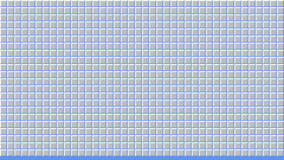

# Campo Minado Infinito

Trabalho de segundo trimestre do segundo ano do COLTEC para a disciplina de programação orientada a objetos.



## Observações

O projeto é em C#, em constraste com as [instruções do trabalho](<https://github.com/eduardo-lamounier/Campo-Minado-Infinito/blob/main/docs/Enunciado do trabalho.pdf>) que explicita o uso de Java; mas isso foi algo aceito por nossa orientadora e conversado de antemão.

## Execução

Você pode baixar tudo necessário para rodar o programa [aqui](<https://github.com/eduardo-lamounier/Campo-Minado-Infinito/releases/tag/1.0.0>).

Caso você queira compilar você mesmo, clone o projeto:

```bash
git clone https://github.com/eduardo-lamounier/Campo-Minado-Infinito.git
```

Se você tiver a CLI do .NET, basta rodar na pasta do projeto:

```bash
dotnet run
```

Se não funcionar, pode ser necessário rodar:

```bash
dotnet restore
```
